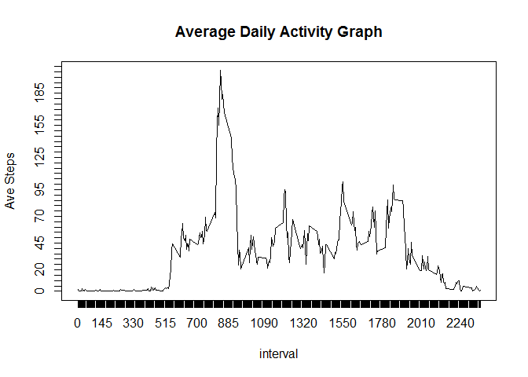
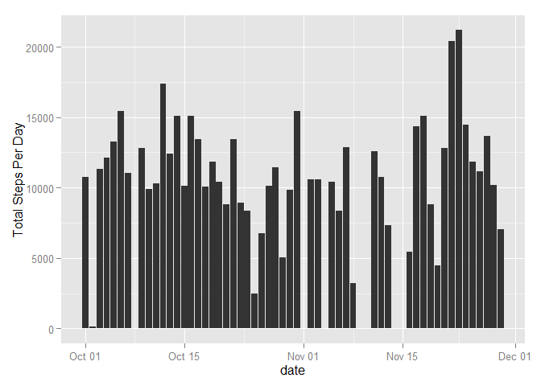

# Reproducible Research: Peer Assessment 1


## Loading and preprocessing the data

Let's Load the Activity data


```r
activity <- unzip("activity.zip")
act1 <- read.csv("activity.csv")
act1$date<- as.Date(act1$date,"%Y-%m-%d") #Changes date column to date class
head(act1)
```

```
##   steps       date interval
## 1    NA 2012-10-01        0
## 2    NA 2012-10-01        5
## 3    NA 2012-10-01       10
## 4    NA 2012-10-01       15
## 5    NA 2012-10-01       20
## 6    NA 2012-10-01       25
```


## What is mean total number of steps taken per day?


Let's create the total steps per day 


```r
pow<-aggregate(act1$steps~act1$date,act1, sum) #totalsteps using aggregate(dataframe)
names(pow)<- c("date","steps")    #renaming columns
head(pow)
```

```
##         date steps
## 1 2012-10-02   126
## 2 2012-10-03 11352
## 3 2012-10-04 12116
## 4 2012-10-05 13294
## 5 2012-10-06 15420
## 6 2012-10-07 11015
```

Let's plot the histogram


```r
library(ggplot2)
```

```
## Warning: package 'ggplot2' was built under R version 3.2.2
```

```r
g <- ggplot(pow,aes(x=date,y=steps))
g1<- g + geom_bar(stat="identity")+ylab("Total Steps Per Day")
g1
```

 


```r
mean(pow$steps)#MEAN total number of steps taken
```

```
## [1] 10766.19
```

```r
median(pow$steps)#MEDIAN total number of steps taken
```

```
## [1] 10765
```


## What is the average daily activity pattern?


Let's create the average number of steps taken for each 5-minute interval
and plot the time series


```r
pow2<-aggregate(act1$steps~act1$interval,act1, mean)#Average daily activity                                                            pattern
                                                     
names(pow2)<- c("interval","steps")
plot(pow2$interval,pow2$steps, type="l",xlab="interval",ylab="Ave Steps Per
interval",main= "Average Daily Activity Graph",at = seq(from=0,
to=max(pow2$interval),by=5))
```

```
## Warning in plot.window(...): "at" is not a graphical parameter
```

```
## Warning in plot.xy(xy, type, ...): "at" is not a graphical parameter
```

```
## Warning in box(...): "at" is not a graphical parameter
```

```
## Warning in title(...): "at" is not a graphical parameter
```

 


```r
goom<- pow2[max(pow2$steps),  ]
goom[1,1] # is the 5-minute interval that may contain the highest #of steps
```

```
## [1] 1705
```


## Imputing missing values


Total number of missing values is


```r
colSums(is.na(act1))
```

```
##    steps     date interval 
##     2304        0        0
```

Before we replace missing values look at original data


```r
head(act1)
```

```
##   steps       date interval
## 1    NA 2012-10-01        0
## 2    NA 2012-10-01        5
## 3    NA 2012-10-01       10
## 4    NA 2012-10-01       15
## 5    NA 2012-10-01       20
## 6    NA 2012-10-01       25
```


NAs replaced with mean number of steps for the respective 5-minute interval:


```r
pow3<-aggregate(act1$steps~act1$interval,act1, mean)
 names(pow3)<- c("intervals","steps")  #Means for each interval


act2<- act1#in order not to messup original data act1
 nas<-is.na(act2$steps)
 act2$steps[nas]<- pow3$steps[nas] #Replacing NAs with means of respective 5-minute interval
                                    

head(act2)  ##Original data filled in by mean of respective 5-minute interval
```

```
##       steps       date interval
## 1 1.7169811 2012-10-01        0
## 2 0.3396226 2012-10-01        5
## 3 0.1320755 2012-10-01       10
## 4 0.1509434 2012-10-01       15
## 5 0.0754717 2012-10-01       20
## 6 2.0943396 2012-10-01       25
```


MEAN and MEDIAN of total number of steps taken each day are


```r
pow4<-aggregate(act2$steps~act2$date,act2, sum)#tsteps using aggregate(dataframe)
names(pow4)<- c("date","steps")#renaming columns

#check with mean and median above. They seem to bethe same
 mean(pow4$steps)
```

```
## [1] 10766.19
```

```r
 median(pow4$steps)
```

```
## [1] 10765.59
```


Data looks like this:


```r
 head(pow4)
```

```
##         date    steps
## 1 2012-10-01 10766.19
## 2 2012-10-02   126.00
## 3 2012-10-03 11352.00
## 4 2012-10-04 12116.00
## 5 2012-10-05 13294.00
## 6 2012-10-06 15420.00
```


Histogram looks like this:


```r
 g <- ggplot(pow4,aes(x=date,y=steps))
g1<- g + geom_bar(stat="identity")+ylab("Total Steps Per Day")
g1
```

 

Plots look similar in addition to almost identical means and medians.
This shows that replacing missing values with me does not change the results
that much if it affects it at all


## Are there differences in activity patterns between weekdays and weekends?


The following code replaces dates with "Weekday" and "Weekend" and 
then displays a few rows:


```r
act22<-act2 #In order not to mess up act2
act22$date<-weekdays(act22$date,abbreviate=F)#date changed to weekdays
head(act22)
```

```
##       steps   date interval
## 1 1.7169811 Monday        0
## 2 0.3396226 Monday        5
## 3 0.1320755 Monday       10
## 4 0.1509434 Monday       15
## 5 0.0754717 Monday       20
## 6 2.0943396 Monday       25
```
